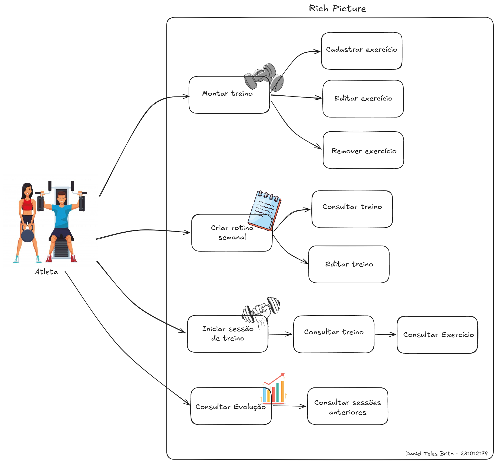
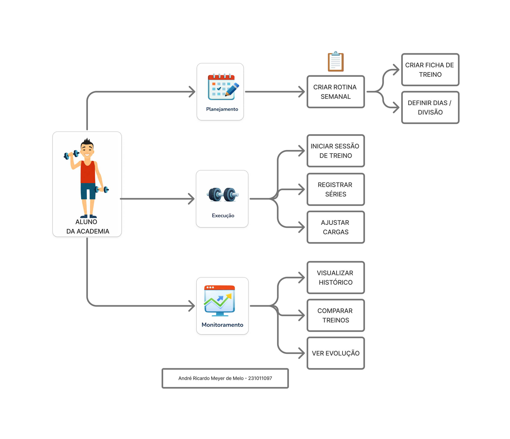
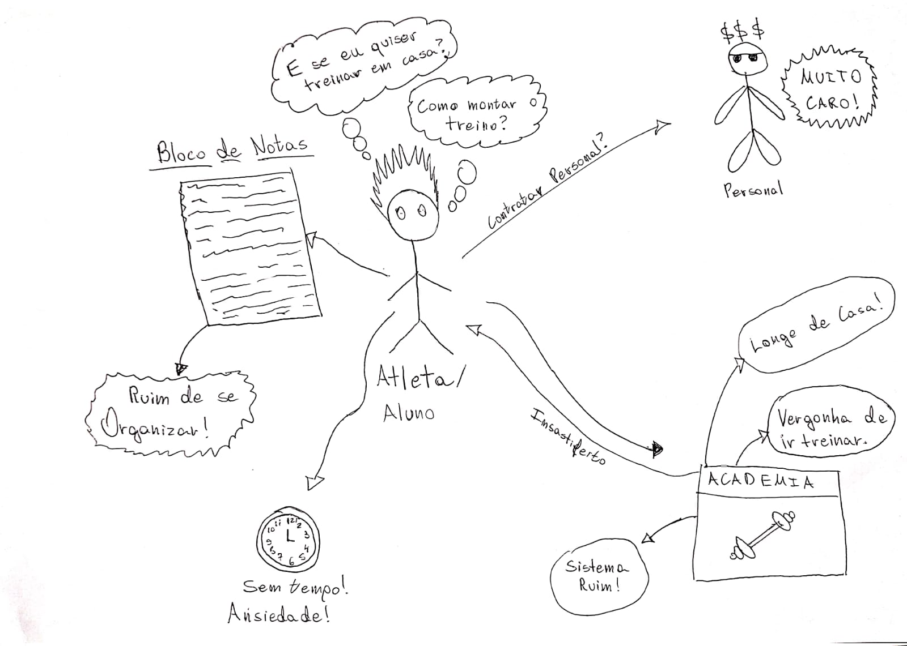
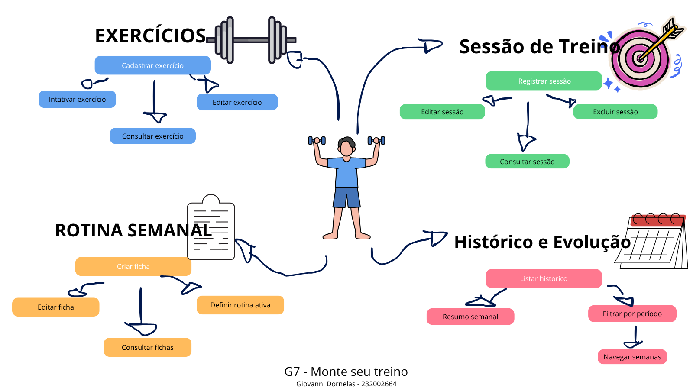

# 1.1. Módulo Design Sprint

> **Orientações:** Usando a lista de projetos indicados por grupo para o período letivo vigente, realizar Design Sprint para levantamento dos requisitos.
>
> **Entrega Mínima:** Design Sprint, evidenciando cada uma das 5 etapas.
>
> **Apresentação:** Explicar passo a passo a Design Sprint realizada, com: (i) rastro claro aos membros participantes (MOSTRAR QUADRO DE PARTICIPAÇÕES & COMMITS); (ii) justificativas & senso crítico sobre o trabalho realizado; e (iii) comentários gerais sobre o trabalho em equipe. Tempo: +/- 5min.
>
> A Wiki ou GitPages do Projeto deve conter um tópico dedicado ao Módulo Design Sprint, com as etapas documentadas, histórico de versões, referências, e demais detalhamentos gerados pela equipe nesse escopo. Demais orientações disponíveis nas Diretrizes (vide Aprender3).

## Introdução

A equipe conduziu uma Design Sprint adaptada para o levantamento de requisitos do projeto G7_MonitoreSeuTreino. O objetivo foi, partindo do escopo definido no [5W2H](Base/1.2.ArtefatoGeneralista.md), mapear o problema, explorar soluções, definir as características do produto, e derivar os requisitos funcionais e não funcionais que guiarão o desenvolvimento do MVP.

A sprint foi estruturada em cinco etapas — Unpack, Sketch, Decision, Prototype e Test — seguindo o modelo proposto por Jake Knapp (Google Ventures), com adaptações ao contexto acadêmico e ao tamanho da equipe (10 integrantes).

## Metodologia

A Design Sprint foi conduzida de forma híbrida (presencial e assíncrona), utilizando as seguintes práticas e ferramentas:

- **Reuniões presenciais** na FGA para alinhamento, revisão e deliberação coletiva (conforme registrado na [Ata de Reunião 01](Base/1.5.IniciativasExtras.md))
- **Trabalho assíncrono** para elaboração individual de artefatos, com revisão por pares via pull request no GitHub
- **Documentação centralizada** na Wiki/GitPages do projeto (Docsify)
- **Padronização terminológica** por meio do [Léxico (LAL)](Base/1.2.ArtefatoGeneralista.md), garantindo alinhamento conceitual entre os membros

A sprint seguiu o seguinte fluxo:

1. **Unpack** — Levantamento do problema, definição de objetivos e pesquisa de mercado
2. **Sketch** — Esboços individuais de soluções *(em andamento)*
3. **Decision** — Definição das características da solução, tecnologias e diferenciais
4. **Prototype** — Construção de protótipo de alta fidelidade *(em andamento)*
5. **Test** — Validação com público-alvo e análise de viabilidade

## Etapa 1 — Unpack (Entender)

De acordo com o documento 5W2H elaborado pela equipe, o projeto G7_MonitoreSeuTreino visa resolver dificuldades comuns no acompanhamento de treinos semanais, como a ausência de organização padronizada da rotina, a perda de informação por controle em papel ou memória, e a dificuldade de analisar a consistência semanal. Nesse contexto, a criação de uma plataforma web responsiva está alinhada às necessidades identificadas, oferecendo um sistema centralizado para planejamento, registro e monitoramento de treinos de forma prática e acessível.

### Objetivo Geral

O objetivo geral do produto é permitir que usuários monitorem seu treino semanal de forma organizada e eficiente, com foco na organização da rotina (ficha semanal), registro de execução (sessões), consulta de histórico e acompanhamento semanal da constância, por meio de uma plataforma web responsiva, simples e de rápido acesso.

### Objetivos Específicos

| Código | Descrição |
| ------ | --------- |
| OE1 | Facilitar o planejamento do treino semanal por meio da criação e edição de fichas de rotina, organizando exercícios e parâmetros de forma padronizada. |
| OE2 | Permitir o registro detalhado da execução real de cada sessão de treino, capturando séries, repetições, carga e observações. |
| OE3 | Disponibilizar um histórico consultável de sessões concluídas, permitindo ao usuário recuperar detalhes de treinos anteriores para comparação e acompanhamento da evolução. |
| OE4 | Apresentar um resumo semanal consolidado que torne visível a constância do usuário no período, facilitando a análise de regularidade e o planejamento dos treinos seguintes. |

### Pesquisa de Mercado e Análise Competitiva

O mercado de aplicativos de monitoramento de treinos é amplo e conta com diversas soluções já consolidadas. Nos últimos anos, houve um crescimento expressivo na busca por ferramentas digitais que auxiliem no acompanhamento de atividades físicas, impulsionado pela popularização de academias e treinos em casa.

Essa realidade apresenta alguns desafios para o usuário comum:

- **Complexidade excessiva:** muitos aplicativos oferecem funcionalidades avançadas (integração com wearables, planos nutricionais, vídeos de exercícios) que sobrecarregam usuários que buscam apenas organizar e registrar seus treinos semanais.
- **Modelo de monetização restritivo:** funcionalidades essenciais frequentemente estão bloqueadas atrás de assinaturas pagas, limitando o acesso gratuito a versões muito básicas.
- **Falta de foco no monitoramento semanal:** poucos aplicativos oferecem uma visão consolidada e simples da constância semanal, priorizando métricas de longo prazo que não atendem ao acompanhamento imediato.

**Análise de Concorrência:**

- **Strong, Hevy e similares:** oferecem amplo catálogo de exercícios e estatísticas detalhadas, porém possuem interfaces carregadas e funcionalidades premium pagas. O foco é em usuários avançados, não em simplicidade para o dia a dia.
- **Planilhas e anotações manuais:** método ainda comum entre praticantes, oferece flexibilidade total, mas carece de organização, é suscetível a perda de dados e não permite visualização consolidada da constância.

## Etapa 2 — Sketch (Esboçar)

Durante esta etapa, os membros da equipe elaboraram rascunhos e representações visuais individuais para explorar as ideias de solução e o fluxo dos usuários.

Abaixo, apresenta-se o diagrama Rich Picture elaborado, que esboça de forma rica e descontraída o ecossistema do aplicativo, a rotina primária do usuário (planejamento, treino e monitoramento) e as interações com o sistema.

*Figura 1: Rich Picture do ecossistema G7_MonitoreSeuTreino. Autor: [Daniel Teles](github.com/dtdanielteles).*

*Figura 2: Rich Picture do ecossistema G7_MonitoreSeuTreino. Autor: [Andre Meyer](github.com/andremeyerr).*

*Figura 3: Rich Picture do ecossistema G7_MonitoreSeuTreino. Autor: [José Victor](github.com/RR2M4A).*

*Figura 3: Rich Picture do ecossistema G7_MonitoreSeuTreino. Autor: [Giovanni Dornelas](github.com/GGDornelas).*

## Etapa 3 — Decision (Decidir)

### Características da Solução

Para resolver os problemas identificados e atender às necessidades dos usuários, a plataforma incorporará as seguintes características:

**1. Ficha de Treino Semanal (Rotina)**

- **Característica:** Sistema para criação e edição de fichas de treino semanais, permitindo ao usuário montar sua rotina por semana (ex.: Treino A/B/C ou por dias da semana), incluindo exercícios e parâmetros planejados como séries e repetições alvo.
- **Como atende ao OE1:** Materializa a organização padronizada do treino semanal, substituindo o controle feito em papel, notas soltas ou memória por uma estrutura digital clara e editável.

**2. Registro de Execução do Treino (Sessão)**

- **Característica:** Funcionalidade para registrar o que foi efetivamente realizado em uma sessão de treino, incluindo data/hora, referência à rotina (quando aplicável), séries, repetições, carga e observações.
- **Como atende ao OE2:** Fornece um mecanismo estruturado para capturar a execução real do treino, garantindo que as informações relevantes sejam registradas de forma organizada e completa.

**3. Histórico de Treinos**

- **Característica:** Listagem de sessões concluídas organizadas por data, com possibilidade de consultar os detalhes de cada sessão (exercícios realizados, séries, repetições, carga e observações).
- **Como atende ao OE3:** Disponibiliza um histórico consultável e detalhado, eliminando a perda de informação e permitindo comparação e acompanhamento da evolução ao longo do tempo.

**4. Resumo Semanal (Monitoramento)**

- **Característica:** Painel consolidado que apresenta a quantidade de treinos realizados na semana (período de segunda a domingo), oferecendo uma visão clara e imediata da regularidade do usuário.
- **Como atende ao OE4:** Torna a constância semanal visível e mensurável, facilitando a análise de regularidade e auxiliando no planejamento dos treinos seguintes.

**5. Interface Responsiva e Simplificada**

- **Característica:** Design de interface responsivo, otimizado para uso em contexto de mobilidade e tempo curto entre séries, com telas simples e rápidas que funcionam bem tanto em desktop quanto em dispositivos móveis via navegador.
- **Como atende aos objetivos gerais:** Garante que o usuário consiga acessar e interagir com todas as funcionalidades de forma rápida e intuitiva, seja na academia ou em casa.

### Diferenciais do MonitoreSeuTreino

- **Simplicidade e foco:** interface enxuta voltada exclusivamente para organização da rotina semanal, registro de sessões e monitoramento da constância.
- **Acessibilidade total:** plataforma web responsiva sem necessidade de instalação, acessível via navegador em qualquer dispositivo.
- **Resumo semanal como funcionalidade central:** destaque para o acompanhamento da constância semanal de forma rápida e direta.
- **Correção facilitada:** edição de registros com validações integradas, garantindo dados limpos e confiáveis no histórico.

### Tecnologias Definidas

| Camada | Tecnologia |
| ------ | ---------- |
| Frontend | React com TypeScript |
| Backend | Node.js com TypeScript |
| Banco de Dados | PostgreSQL ou MongoDB (em análise) |
| Infraestrutura | Deploy em serviço gratuito ou de baixo custo |

## Etapa 4 — Prototype (Prototipar)

<!-- Apresente o protótipo construído pela equipe. Inclua screenshots ou links. -->

## Etapa 5 — Test (Validar)

<!-- Descreva como foi feita a validação do protótipo e quais feedbacks foram coletados. -->

### Análise de Viabilidade

A viabilidade técnica do projeto é considerada alta, visto que a equipe possui experiência prévia nas tecnologias que serão utilizadas, como React, Node.js e TypeScript. No que se refere ao banco de dados, a equipe possui menor experiência com as tecnologias em análise (PostgreSQL ou MongoDB), porém a curva de aprendizado não é considerada um impeditivo.

O prazo estimado para desenvolvimento é de aproximadamente 18 semanas, dividido em quatro marcos incrementais:

1. Definição do escopo e protótipos
2. Implementação do núcleo (rotina semanal e sessão de treino)
3. Evolução do núcleo (histórico e edição/correção)
4. Monitoramento (resumo semanal, testes e preparação da apresentação)

Em termos econômicos, o projeto apresenta custos não monetários, baseados essencialmente em horas de trabalho dos membros da equipe (estimativa de 4 a 6 horas semanais por integrante, totalizando 72 a 108 horas por pessoa) e custos de coordenação. A infraestrutura será hospedada em serviços gratuitos ou de baixo custo.

### Impacto Esperado da Solução

1. **Organização padronizada do treino:** substituição de métodos informais por uma estrutura digital clara e acessível.
2. **Visibilidade da constância:** resumo semanal consolidado para análise imediata de consistência.
3. **Recuperação e consulta do histórico:** eliminação da perda de informação, permitindo comparação e acompanhamento da evolução.
4. **Praticidade e acessibilidade:** interface responsiva otimizada para uso rápido na academia ou em casa.
5. **Sustentabilidade do projeto:** tecnologias consolidadas e infraestrutura de baixo custo garantem viabilidade a longo prazo.

## Resultados da Sprint — Requisitos de Software

Como resultado consolidado das etapas anteriores da Design Sprint, a equipe derivou os requisitos de software do sistema G7_MonitoreSeuTreino. Os requisitos foram elaborados a partir dos problemas mapeados na **Etapa 1 (Unpack)**, das características definidas na **Etapa 3 (Decision)** e da análise de viabilidade da **Etapa 5 (Test)**, com rastreabilidade direta ao [5W2H](Base/1.2.ArtefatoGeneralista.md) e ao [Léxico (LAL)](Base/1.2.ArtefatoGeneralista.md) elaborados pela equipe.

Está organizado em: regras de negócio, requisitos funcionais (organizados por módulo, orientados a comportamento e com rastreabilidade dupla aos objetivos específicos) e requisitos não funcionais (mensuráveis e com critérios de teste explícitos).

### Regras de Negócio

As regras de negócio definem restrições, políticas e comportamentos que o sistema deve respeitar independentemente da funcionalidade específica.

| Código | Regra | Descrição |
| ------ | ----- | --------- |
| RN01 | Definição de semana | A semana para fins de resumo semanal deve ser considerada de segunda-feira 00:00 até domingo 23:59, no fuso horário configurado pelo sistema (padrão: América/São Paulo). |
| RN02 | Contagem de sessões no resumo | Cada sessão registrada conta como uma unidade no resumo semanal, independentemente da sua duração ou quantidade de exercícios registrados. Múltiplas sessões no mesmo dia devem ser contabilizadas individualmente. |
| RN03 | Associação sessão-rotina opcional | A associação entre uma sessão de treino e uma ficha de rotina semanal deve ser opcional, permitindo o registro de sessões avulsas sem vínculo a nenhuma rotina. |
| RN04 | Preservação do histórico em exclusões | A exclusão de exercícios ou rotinas não deve afetar sessões já registradas no histórico. Entidades excluídas devem ser marcadas como inativas, mantendo a integridade dos registros históricos. |
| RN05 | Unicidade de rotina ativa | O sistema deve permitir que apenas uma ficha de rotina semanal esteja marcada como ativa por vez. A rotina ativa deve ser utilizada como padrão sugerido ao iniciar o registro de uma nova sessão. |
| RN06 | Campos obrigatórios de sessão | Toda sessão de treino deve conter, no mínimo: data, pelo menos um exercício registrado e, para cada exercício, ao menos uma série com repetições informadas e carga informada. |
| RN07 | Valores numéricos válidos | Campos numéricos de séries e repetições devem aceitar apenas valores inteiros maiores que zero. O campo de carga deve aceitar valores maiores ou iguais a zero (para contemplar exercícios com peso corporal). O sistema deve exibir mensagem de erro clara caso o usuário tente salvar valores fora desses limites. |
| RN08 | Definição de constância semanal | A constância semanal é definida como a quantidade total de sessões registradas na semana e a quantidade de dias distintos com pelo menos uma sessão. Ambas as métricas devem ser exibidas no resumo semanal. |
| RN09 | Independência da sessão após pré-preenchimento | Quando uma sessão é criada a partir de uma rotina vinculada com dados pré-preenchidos, o usuário pode alterar livremente os dados da sessão sem afetar a rotina original. A sessão mantém apenas a referência à rotina de origem para fins de rastreabilidade. |

### Requisitos Funcionais

Os requisitos funcionais descrevem os comportamentos específicos que o sistema deverá implementar, organizados por módulo com rastreabilidade dupla: objetivo específico e característica da solução.

#### Módulo: Exercício

| Código | Nome | Descrição | Rastreabilidade |
| ------ | ---- | --------- | --------------- |
| RF01 | Cadastrar exercício | O sistema deve permitir que o usuário cadastre um exercício informando nome (obrigatório) e, opcionalmente, grupo muscular ou categoria. O exercício cadastrado deve ficar disponível imediatamente para seleção na criação e edição de fichas de rotina. | OE1 / Ficha de Treino Semanal |
| RF02 | Consultar exercícios | O sistema deve permitir que o usuário consulte exercícios cadastrados por nome ou grupo muscular, exibindo a lista de resultados correspondentes ordenada alfabeticamente. Exercícios inativos não devem aparecer na consulta padrão. | OE1 / Ficha de Treino Semanal |
| RF03 | Editar exercício | O sistema deve permitir que o usuário edite nome, grupo muscular ou categoria de um exercício ativo. As alterações devem ser refletidas em todas as rotinas que utilizam o exercício, sem afetar sessões já registradas (conforme RN04). | OE1 / Ficha de Treino Semanal |
| RF04 | Inativar exercício | O sistema deve permitir que o usuário inative um exercício, mediante confirmação. O exercício inativado deixa de aparecer na seleção de novos cadastros, mas permanece visível nas rotinas e sessões históricas que o referenciam (conforme RN04). | OE1 / Ficha de Treino Semanal |

#### Módulo: Rotina Semanal

| Código | Nome | Descrição | Rastreabilidade |
| ------ | ---- | --------- | --------------- |
| RF05 | Criar ficha de treino semanal | O sistema deve permitir que o usuário crie uma ficha de treino semanal composta por múltiplos dias ou divisões (ex.: Treino A/B/C), contendo uma lista ordenada de exercícios previamente cadastrados, cada um com parâmetros planejados (séries e repetições alvo). A ficha criada deve ficar disponível como base para registro de sessões futuras. | OE1 / Ficha de Treino Semanal |
| RF06 | Consultar fichas de treino semanal | O sistema deve permitir que o usuário visualize a lista de suas fichas de treino semanais, com indicação clara de qual está marcada como ativa (conforme RN05), e acesse os detalhes de cada uma (dias, exercícios e parâmetros). | OE1 / Ficha de Treino Semanal |
| RF07 | Editar ficha de treino semanal | O sistema deve permitir que o usuário edite uma ficha de treino semanal existente, podendo alterar dias/divisões, adicionar ou remover exercícios e modificar parâmetros planejados, sem afetar sessões já registradas com base nessa ficha. | OE1 / Ficha de Treino Semanal |
| RF08 | Inativar ficha de treino semanal | O sistema deve permitir que o usuário inative uma ficha de treino semanal, mediante confirmação. A ficha inativada não aparece mais como opção de rotina ativa, mas as sessões históricas vinculadas a ela permanecem acessíveis no histórico (conforme RN04). | OE1 / Ficha de Treino Semanal |
| RF09 | Definir rotina ativa | O sistema deve permitir que o usuário marque uma ficha de rotina como ativa. Ao ativar uma ficha, qualquer outra ficha anteriormente ativa deve ser desmarcada automaticamente (conforme RN05). | OE1 / Ficha de Treino Semanal |

#### Módulo: Sessão de Treino

| Código | Nome | Descrição | Rastreabilidade |
| ------ | ---- | --------- | --------------- |
| RF10 | Registrar sessão de treino | O sistema deve permitir que o usuário registre a execução real de uma sessão de treino, informando data/hora e, opcionalmente, vinculando a uma rotina (conforme RN03). O usuário deve selecionar exercícios previamente cadastrados ou, caso vincule uma rotina, o sistema deve pré-preencher os exercícios e parâmetros da rotina ativa, permitindo que o usuário registre apenas a execução real. Os dados pré-preenchidos podem ser livremente alterados sem afetar a rotina original (conforme RN09). Ao salvar, a sessão deve ser contabilizada automaticamente no resumo semanal e aparecer no histórico. | OE2 / Registro de Execução |
| RF11 | Consultar sessão de treino | O sistema deve permitir que o usuário acesse os detalhes completos de uma sessão registrada, incluindo data/hora, rotina vinculada (se houver), e para cada exercício: séries, repetições, carga e observações. | OE2, OE3 / Registro de Execução, Histórico de Treinos |
| RF12 | Editar sessão de treino | O sistema deve permitir que o usuário corrija informações de uma sessão registrada (ex.: ajustar carga, repetições ou observações), respeitando as regras de validação (conforme RN07). As alterações devem ser refletidas automaticamente no histórico e no resumo semanal, sem necessidade de recarregamento da página (conforme RNF-C03). | OE2, OE3 / Registro de Execução, Histórico de Treinos |
| RF13 | Excluir sessão de treino | O sistema deve permitir que o usuário exclua uma sessão de treino registrada, mediante confirmação explícita. A remoção deve atualizar automaticamente o histórico e o resumo semanal. | OE2, OE3 / Registro de Execução, Histórico de Treinos |

#### Módulo: Histórico

| Código | Nome | Descrição | Rastreabilidade |
| ------ | ---- | --------- | --------------- |
| RF14 | Listar histórico de sessões | O sistema deve listar todas as sessões de treino concluídas, organizadas por data em ordem decrescente (mais recente primeiro), exibindo data, rotina vinculada (se houver) e quantidade de exercícios registrados. | OE3 / Histórico de Treinos |
| RF15 | Filtrar histórico por período | O sistema deve permitir que o usuário filtre o histórico de sessões por intervalo de datas (data inicial e final), exibindo apenas as sessões realizadas no período selecionado. | OE3 / Histórico de Treinos |

#### Módulo: Monitoramento Semanal

| Código | Nome | Descrição | Rastreabilidade |
| ------ | ---- | --------- | --------------- |
| RF16 | Exibir resumo semanal | O sistema deve apresentar um painel de resumo semanal contendo: a quantidade total de sessões realizadas no período (segunda 00:00 a domingo 23:59, conforme RN01), os dias com atividade registrada, e a quantidade de dias distintos com treino (conforme RN08). Múltiplas sessões no mesmo dia devem ser contabilizadas individualmente (conforme RN02). | OE4 / Resumo Semanal |
| RF17 | Navegar entre semanas no resumo | O sistema deve permitir que o usuário navegue entre semanas anteriores e a semana atual no painel de resumo, visualizando o consolidado de cada período. | OE4 / Resumo Semanal |

### Requisitos Não Funcionais

Os requisitos não funcionais descrevem as qualidades e restrições que o sistema deve atender. Todos são mensuráveis e incluem critério de teste explícito.

#### Usabilidade

| Código | Nome | Descrição e Critério de Teste |
| ------ | ---- | ----------------------------- |
| RNF-U01 | Navegação intuitiva | O fluxo principal (criar rotina, registrar sessão, consultar resumo) deve ser acessível em no máximo 3 níveis de navegação a partir da tela inicial. Critério de teste: validado por teste de usabilidade com no mínimo 5 usuários, onde 80% devem completar o fluxo sem assistência em até 5 minutos. |
| RNF-U02 | Feedback visual | O sistema deve fornecer feedbacks visuais claros e imediatos para todas as ações do usuário (confirmações, erros, carregamentos). Critério de teste: 100% das ações de criação, edição e exclusão devem exibir mensagem de confirmação ou erro, verificado por checklist funcional em cada release. |
| RNF-U03 | Design consistente | A interface deve seguir um padrão visual único (cores, tipografia, espaçamentos, componentes). Critério de teste: auditoria visual comparando todas as telas com o guia de estilo, com zero desvios de componentes ou cores permitidos. |
| RNF-U04 | Interface responsiva | O sistema deve renderizar corretamente em viewports de 360px a 1920px, sem rolagem horizontal, com elementos interativos de no mínimo 44x44 pixels. Critério de teste: verificado em Chrome DevTools nos breakpoints 360px, 768px e 1920px para cada tela. |
| RNF-U05 | Simplicidade funcional | O registro de uma sessão de treino padrão (com rotina vinculada) não deve exigir mais de 3 interações do usuário (selecionar rotina, preencher execução, salvar). Critério de teste: contagem de cliques/toques em teste com 5 usuários, onde 80% devem concluir em até 3 interações. |

#### Confiabilidade

| Código | Nome | Descrição e Critério de Teste |
| ------ | ---- | ----------------------------- |
| RNF-C01 | Disponibilidade 24/7 | O sistema deve apresentar uptime mínimo de 95% ao mês (no máximo 36 horas de indisponibilidade/mês), excluindo manutenções programadas comunicadas com 24 horas de antecedência. Critério de teste: monitoramento via serviço de uptime (ex.: UptimeRobot) com relatório mensal. |
| RNF-C02 | Backup de dados críticos | O sistema deve realizar backups automáticos diários dos dados (rotinas, sessões, histórico), com restauração completa possível em no máximo 4 horas. Critério de teste: simulação de restauração a partir de backup em ambiente de homologação a cada release major. |
| RNF-C03 | Consistência de dados | Edições e exclusões em sessões devem refletir no histórico e no resumo semanal em no máximo 5 segundos, sem recarregamento manual. Critério de teste: medição do tempo entre confirmação da ação e atualização visível na interface, em 10 operações consecutivas. |

#### Desempenho

| Código | Nome | Descrição e Critério de Teste |
| ------ | ---- | ----------------------------- |
| RNF-D01 | Tempo de carregamento (< 3s) | As telas devem atingir Largest Contentful Paint (LCP) em até 3 segundos em conexão 4G (10 Mbps). Critério de teste: medição via Chrome DevTools (Lighthouse ou Performance) com throttling "Regular 4G" para cada tela da aplicação. |
| RNF-D02 | Tempo de resposta a interações (< 2s) | Ações do usuário devem retornar feedback visual em no máximo 1 segundo e concluir processamento em no máximo 2 segundos. Critério de teste: cronometragem de 10 operações de salvar/editar/excluir em ambiente de produção. |

#### Suportabilidade

| Código | Nome | Descrição e Critério de Teste |
| ------ | ---- | ----------------------------- |
| RNF-S01 | Logging de erros | O sistema deve registrar logs de erros e eventos críticos (falhas de salvamento, indisponibilidade) com timestamp, tipo de erro e contexto. Critério de teste: provocar 5 cenários de falha em homologação e verificar se 100% foram registrados nos logs. |
| RNF-S02 | Versionamento de código | Todo código-fonte deve estar versionado em Git, com histórico de commits rastreável, e todo código em produção deve passar por revisão via pull request por pelo menos 1 membro. Critério de teste: auditoria do repositório verificando que zero commits diretos na branch principal ocorreram sem pull request. |

#### Portabilidade

| Código | Nome | Descrição e Critério de Teste |
| ------ | ---- | ----------------------------- |
| RNF-P01 | Plataforma web | O sistema deve ser acessível integralmente via navegador web, sem instalação de app nativo ou plugin. Critério de teste: acesso completo ao fluxo principal via Chrome, Firefox, Safari e Edge sem erros, em dispositivo limpo (sem extensões). |
| RNF-P02 | Compatibilidade de navegadores | O sistema deve funcionar sem erros visuais ou funcionais nas duas últimas versões estáveis de Chrome, Firefox, Safari e Edge. Critério de teste: execução do checklist funcional completo em cada navegador a cada release, com zero erros bloqueantes. |

## Senso Crítico

A adoção da Design Sprint como metodologia para o levantamento de requisitos permitiu à equipe estruturar o processo de forma iterativa e colaborativa. A Etapa 1 (Unpack) foi fundamental para alinhar o entendimento do problema entre todos os membros, partindo do 5W2H previamente elaborado. A pesquisa de mercado evidenciou uma lacuna real: a maioria das soluções existentes prioriza funcionalidades avançadas em detrimento da simplicidade, validando a proposta do MonitoreSeuTreino.

Na Etapa 3 (Decision), a definição das características da solução foi guiada pela rastreabilidade direta aos objetivos específicos (OE1–OE4), garantindo que cada funcionalidade tenha justificativa clara. Os requisitos funcionais e não funcionais foram organizados por módulo com rastreabilidade dupla, o que facilita a verificação de cobertura e a priorização no backlog.

Uma limitação identificada é que a Etapa 4 (Prototype) ainda está pendente de documentação e a Etapa 2 (Sketch) está sendo alimentada progressivamente, o que será complementado com o restante dos esboços e o protótipo de alta fidelidade em desenvolvimento pela equipe.

## Rastreabilidade

O diagrama abaixo apresenta os elos entre os artefatos produzidos nesta entrega:

| Artefato de Origem | Artefato de Destino | Tipo de Elo |
| ------------------- | ------------------- | ----------- |
| [5W2H](Base/1.2.ArtefatoGeneralista.md) | Visão do Produto (Etapa 1) | O 5W2H fundamentou a identificação do problema e do escopo do MVP |
| [Léxico (LAL)](Base/1.2.ArtefatoGeneralista.md) | Requisitos Funcionais | Os termos do léxico padronizam a linguagem usada nos requisitos (ex.: L03-Rotina, L06-Sessão, L12-Histórico) |
| Visão do Produto (Etapa 1) | Objetivos Específicos (OE1–OE4) | Os objetivos derivam diretamente dos problemas identificados na visão |
| Objetivos Específicos (OE1–OE4) | Requisitos Funcionais (RF01–RF17) | Cada RF é rastreado a pelo menos um OE |
| Características da Solução (Etapa 3) | Requisitos Funcionais (RF01–RF17) | Cada característica se desdobra em requisitos específicos por módulo |
| Regras de Negócio (RN01–RN09) | Requisitos Funcionais | RFs referenciam RNs aplicáveis (ex.: RF10→RN03, RN09; RF04→RN04) |
| Requisitos Funcionais | Requisitos Não Funcionais | RNFs complementam os RFs com restrições de qualidade (ex.: RF12→RNF-C03) |
| [Ata de Reunião 01](Base/1.5.IniciativasExtras.md) | Distribuição de tarefas | A ata registra a deliberação e aprovação dos artefatos pela equipe |

## Referências

- KNAPP, Jake; ZERATSKY, John; KOWITZ, Braden. **Sprint: How to Solve Big Problems and Test New Ideas in Just Five Days**. Simon & Schuster, 2016.
- GOOGLE VENTURES. **The Design Sprint**. Disponível em: https://www.gv.com/sprint/. Acesso em: mar. 2026.
- SOMMERVILLE, Ian. **Engenharia de Software**. 10. ed. Pearson, 2019.

## Histórico de Versões

| Versão | Data       | Descrição            | Autor(es)       | Revisor(es)     |
| ------ | ---------- | -------------------- | --------------- | --------------- |
| 1.0    | 31/03/2026 | Criação do documento | Lucas Antunes   | —               |
| 1.1    | 31/03/2026 | Adição da Visão do Produto | Lucas Antunes   | —               |
| 1.2    | 31/03/2026 | Adição dos Requisitos de Software | Lucas Antunes   | —               |
| 1.3    | 31/03/2026 | Reorganização dos requisitos, senso crítico e rastreabilidade | Lucas Antunes   | —               |
| 1.4    | 03/04/2026 | Adiciona rich picture individual | Daniel Teles   | —               |
