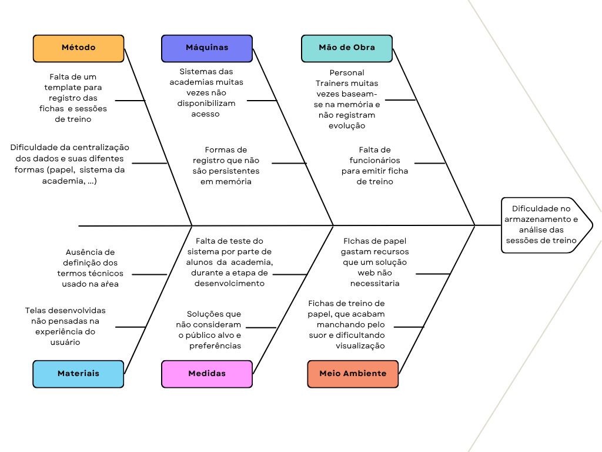
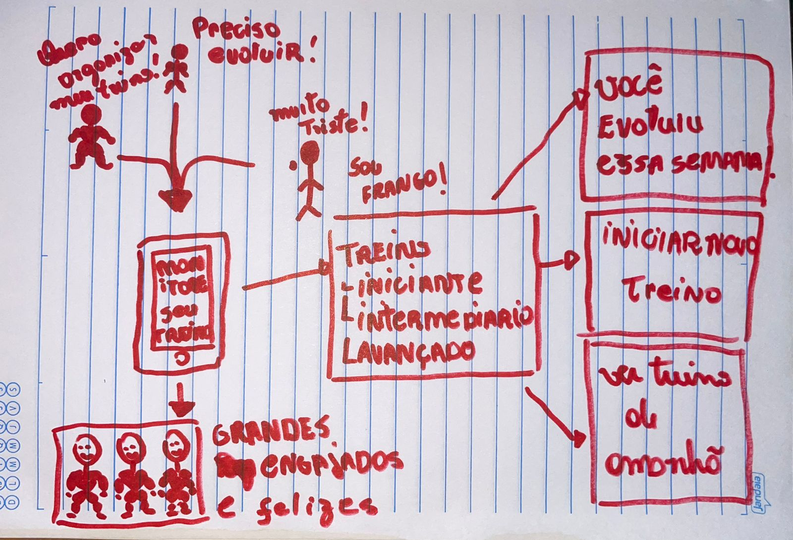
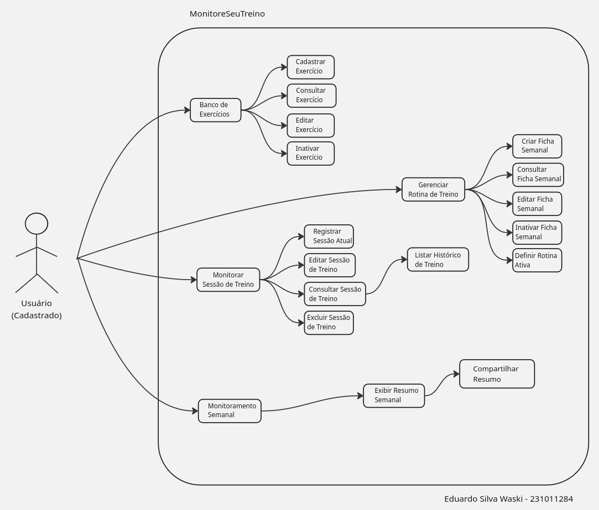

# 1.1. Módulo Design Sprint

> **Orientações:** Usando a lista de projetos indicados por grupo para o período letivo vigente, realizar Design Sprint para levantamento dos requisitos.
>
> **Entrega Mínima:** Design Sprint, evidenciando cada uma das 5 etapas.
>
> **Apresentação:** Explicar passo a passo a Design Sprint realizada, com: (i) rastro claro aos membros participantes (MOSTRAR QUADRO DE PARTICIPAÇÕES & COMMITS); (ii) justificativas & senso crítico sobre o trabalho realizado; e (iii) comentários gerais sobre o trabalho em equipe. Tempo: +/- 5min.
>
> A Wiki ou GitPages do Projeto deve conter um tópico dedicado ao Módulo Design Sprint, com as etapas documentadas, histórico de versões, referências, e demais detalhamentos gerados pela equipe nesse escopo. Demais orientações disponíveis nas Diretrizes (vide Aprender3).

## Introdução

A equipe conduziu uma Design Sprint adaptada para o levantamento de requisitos do projeto G7_MonitoreSeuTreino. Partindo do escopo definido no [5W2H](Base/1.2.ArtefatoGeneralista.md) e do entendimento do público-alvo documentado no ICP, o objetivo foi mapear o problema central dos praticantes de exercícios físicos, explorar soluções por meio de representações visuais, consolidar a visão do produto com objetivos específicos e características mensuráveis, especificar os requisitos de software e estruturar o backlog do produto com rastreabilidade completa.

A sprint foi estruturada em cinco etapas — Unpack, Sketch, Decision, Prototype e Test — seguindo o modelo proposto por Jake Knapp (Google Ventures), com adaptações ao contexto acadêmico e ao tamanho da equipe (10 integrantes). Os documentos detalhados produzidos em cada etapa estão organizados em páginas próprias e referenciados a seguir.

## Metodologia

A Design Sprint foi conduzida de forma híbrida (presencial e assíncrona), utilizando as seguintes práticas e ferramentas:

- **Reuniões presenciais** na FGA para alinhamento, revisão e deliberação coletiva (conforme registrado na [Ata de Reunião 01](Base/1.5.IniciativasExtras.md))
- **Trabalho assíncrono** para elaboração individual de artefatos, com revisão por pares via pull request no GitHub
- **Documentação centralizada** na Wiki/GitPages do projeto (Docsify)
- **Padronização terminológica** por meio do [Léxico (LAL)](Base/1.2.ArtefatoGeneralista.md), garantindo alinhamento conceitual entre os membros

### Gestão de Atividades — Quadro Kanban (GitHub Projects)

Para acompanhar o andamento das atividades ao longo de todo o projeto, a equipe adotou um **quadro Kanban** utilizando o recurso **GitHub Projects** ([link do quadro](https://github.com/orgs/UnBArqDsw2026-1-Turma01/projects/4)). O quadro centraliza a gestão das tarefas e oferece visibilidade sobre o progresso individual e coletivo, servindo como ferramenta de coordenação contínua entre os membros.

Cada tarefa é representada por uma **issue** no repositório, categorizada por meio de **labels** e organizada em **colunas de status** no quadro. Essa estrutura permite que a equipe identifique rapidamente o que está pendente, em andamento, em revisão ou concluído — tanto nas entregas parciais quanto na visão geral do projeto.

**Colunas de status:**

| Status | Descrição |
| ------ | --------- |
| Todo | Tarefa identificada e atribuída, aguardando início |
| In Progress | Tarefa em desenvolvimento pelo responsável |
| In Review | Tarefa concluída pelo autor, aguardando revisão ou com alterações solicitadas |
| Done | Tarefa revisada, aprovada e integrada |

**Labels — Fases da Design Sprint:**

As issues são categorizadas de acordo com a etapa da Design Sprint à qual pertencem, facilitando a filtragem e o acompanhamento por fase:

| Label | Fase correspondente |
| ----- | ------------------- |
| `fase:unpack` | Fase 1 — Unpack (Entender) |
| `fase:sketch` | Fase 2 — Sketch (Esboçar) |
| `fase:decide` | Fase 3 — Decide (Decidir) |
| `fase:prototype` | Fase 4 — Prototype (Prototipar) |
| `fase:validation` | Fase 5 — Validation (Validar) |

**Labels — Prioridade:**

| Label | Descrição |
| ----- | --------- |
| `prioridade:alta` | Tarefa com prazo curto ou bloqueante para outras atividades |
| `prioridade:media` | Tarefa com prazo flexível |

O padrão de nomenclatura das issues segue o formato `[Fase] Descrição da tarefa` (ex.: `[Unpack] Elaborar 5W2H`, `[Decide] Criar Product Backlog`), o que permite identificar a etapa da sprint diretamente pelo título. Mais detalhes sobre o uso do GitHub Projects estão disponíveis em [Iniciativas Extras](Base/1.5.IniciativasExtras.md).

### Fluxo da Sprint

A sprint seguiu o seguinte fluxo:

| # | Etapa | Artefatos |
| - | ----- | --------- |
| 1 | **Unpack** — Entender o problema | [5W2H](Base/1.2.ArtefatoGeneralista.md), [Léxico](Base/1.2.ArtefatoGeneralista.md), Benchmark, Mapa Mental, Ishikawa |
| 2 | **Sketch** — Esboçar soluções | Rich Picture de cada membro |
| 3 | **Decision** — Decidir e especificar | [Visão do Produto](Base/1.1.1.VisaoProduto.md), [Requisitos de Software](Base/1.1.2.Requisitos.md), [Backlog do Produto](Base/1.1.3.BacklogProduto.md) |
| 4 | **Prototype** — Prototipar | Protótipo de alta fidelidade |
| 5 | **Test** — Validar | Checklist de verificação, Formulário de validação |

## Etapa 1 — Unpack (Entender)

Nesta etapa, a equipe se reuniu para compreender o problema central e alinhar o entendimento entre todos os membros. A partir do documento [5W2H](Base/1.2.ArtefatoGeneralista.md), foram identificadas as dificuldades comuns no acompanhamento de treinos semanais — como a ausência de organização padronizada da rotina, a perda de informação por controle em papel ou memória, e a dificuldade de analisar a consistência semanal. Complementarmente, o [Léxico (LAL)](Base/1.2.ArtefatoGeneralista.md) padronizou a terminologia utilizada, o Mapa Mental estruturou o escopo do projeto, o Diagrama de Ishikawa mapeou as causas raiz dos problemas e o Benchmark comparou soluções concorrentes do mercado.

### Pesquisa de Mercado e Análise Competitiva

O mercado de aplicativos de monitoramento de treinos é amplo e conta com diversas soluções já consolidadas. Nos últimos anos, houve um crescimento expressivo na busca por ferramentas digitais que auxiliem no acompanhamento de atividades físicas, impulsionado pela popularização de academias e treinos em casa.

Essa realidade apresenta alguns desafios para o usuário comum:

- **Complexidade excessiva:** muitos aplicativos oferecem funcionalidades avançadas (integração com wearables, planos nutricionais, vídeos de exercícios) que sobrecarregam usuários que buscam apenas organizar e registrar seus treinos semanais.
- **Modelo de monetização restritivo:** funcionalidades essenciais frequentemente estão bloqueadas atrás de assinaturas pagas, limitando o acesso gratuito a versões muito básicas.
- **Falta de foco no monitoramento semanal:** poucos aplicativos oferecem uma visão consolidada e simples da constância semanal, priorizando métricas de longo prazo que não atendem ao acompanhamento imediato.

**Análise de Concorrência:**

- **Strong, Hevy e similares:** oferecem amplo catálogo de exercícios e estatísticas detalhadas, porém possuem interfaces carregadas e funcionalidades premium pagas. O foco é em usuários avançados, não em simplicidade para o dia a dia.
- **Planilhas e anotações manuais:** método ainda comum entre praticantes, oferece flexibilidade total, mas carece de organização, é suscetível a perda de dados e não permite visualização consolidada da constância.

### Diagrama Ishikawa (6M)

O Diagrama de Ishikawa, também conhecido como Espinha de Peixe ou Causa e Efeito, é uma ferramenta visual de gestão da qualidade utilizada para identificar e estruturar as causas raízes de um problema específico.

Ele organiza as possíveis fontes de falhas em categorias principais — geralmente os 6Ms (Método, Máquina, Medida, Meio Ambiente, Material e Mão de Obra)

Desenvolvemos um com o objetivo de identificar dores e dificuldades em cada ponto.

*Figura 1: Diagrama de Ishikawa

## Etapa 2 — Sketch (Esboçar)

Nesta etapa, os membros da equipe elaboraram rascunhos e representações visuais individuais para explorar as ideias de solução e o fluxo dos usuários. Cada integrante produziu um Rich Picture que esboça de forma rica e descontraída o ecossistema do aplicativo, a rotina primária do usuário (planejamento, treino e monitoramento) e as interações com o sistema.

<strong>Daniel Teles</strong> — Rich Picture do ecossistema G7_MonitoreSeuTreino

*Figura 2: Rich Picture do ecossistema G7_MonitoreSeuTreino. Autor: [Daniel Teles](https://github.com/dtdanielteles).*

<strong>Giovanni Dornelas</strong> — Rich Picture do ecossistema G7_MonitoreSeuTreino

*Figura 3: Rich Picture do ecossistema G7_MonitoreSeuTreino. Autor: [Giovanni Dornelas](github.com/GGDornelas).*

<strong>Lucas Antunes</strong> — Rich Picture do ecossistema G7_MonitoreSeuTreino

*Figura 4: Rich Picture do ecossistema G7_MonitoreSeuTreino. Autor: [Lucas Antunes](github.com/LucasAntunes-UNB).*

<strong>Andre Meyer</strong> — Rich Picture do ecossistema G7_MonitoreSeuTreino

*Figura 5: Rich Picture do ecossistema G7_MonitoreSeuTreino. Autor: [Andre Meyer](https://github.com/andremeyerr).*

<strong>José Victor</strong> — Rich Picture do ecossistema G7_MonitoreSeuTreino

*Figura 6: Rich Picture do ecossistema G7_MonitoreSeuTreino. Autor: [José Victor](https://github.com/RR2M4A).*

<strong>Eduardo Waski</strong> — Rich Picture do ecossistema G7_MonitoreSeuTreino

*Figura 7: Rich Picture do ecossistema G7_MonitoreSeuTreino. Autor: [Eduardo Waski](https://github.com/EduardoWaski).*

## Etapa 3 — Decision (Decidir)

Nesta etapa, a equipe consolidou as decisões sobre o produto a partir dos problemas mapeados na Etapa 1 e dos esboços da Etapa 2. Foram produzidos três documentos fundamentais que definem o que o sistema faz, como deve se comportar e como o trabalho será organizado:

- **[Visão do Produto](Base/1.1.1.VisaoProduto.md)** — Define o objetivo geral, os cinco objetivos específicos (OE1–OE5), as características da solução, o escopo negativo e o impacto esperado.
- **[Requisitos de Software](Base/1.1.2.Requisitos.md)** — Especifica 12 regras de negócio (RN01–RN12), 29 requisitos funcionais (RF01–RF29) organizados por módulo e requisitos não funcionais mensuráveis nas categorias de usabilidade, confiabilidade, desempenho, segurança, suportabilidade e portabilidade.
- **[Backlog do Produto](Base/1.1.3.BacklogProduto.md)** — Estrutura hierárquica com 5 épicos, 9 features, 29 user stories, 59 tasks e 236 critérios de aceitação, com rastreabilidade completa aos requisitos funcionais.

### Diferenciais do MonitoreSeuTreino

- **Simplicidade e foco:** interface enxuta voltada exclusivamente para organização da rotina semanal, registro de sessões e monitoramento da constância.
- **Acessibilidade total:** plataforma web responsiva sem necessidade de instalação, acessível via navegador em qualquer dispositivo.
- **Resumo semanal como funcionalidade central:** destaque para o acompanhamento da constância semanal de forma rápida e direta.
- **Correção facilitada:** edição de registros com validações integradas, garantindo dados limpos e confiáveis no histórico.

### Tecnologias Definidas

| Camada | Tecnologia |
| ------ | ---------- |
| Frontend | React com TypeScript |
| Backend | Node.js com TypeScript |
| Banco de Dados | PostgreSQL ou MongoDB (em análise) |
| Infraestrutura | Deploy em serviço gratuito ou de baixo custo |

## Etapa 4 — Prototype (Prototipar)

Nesta etapa, a equipe desenvolveu um protótipo de alta fidelidade com o objetivo de materializar as decisões tomadas na Etapa 3 (Decision), permitindo a visualização concreta do sistema e a validação antecipada das interações do usuário com a solução proposta.

O protótipo foi construído com base nos **[Requisitos de Software](Base/1.1.2.Requisitos.md)** (RF01–RF29) e nas características da solução, priorizando o escopo do MVP definido pela equipe.

### Ferramentas Utilizadas
  - **Figma:** construção do protótipo de alta fidelidade e definição do design das interfaces - https://www.figma.com/design/0d6wLlJy9Ch4P1h1M3CTED/Projeto-Academia?node-id=39-52&p=f&t=voLuszyMP8cAvmh1-0
  - **Maze:** validação do protótipo por meio de testes de usabilidade guiados - https://app.maze.co/maze-preview/mazes/519454254

### Escopo do Protótipo
O protótipo cobre os principais fluxos do sistema dentro do MVP, com foco na jornada principal do usuário:
  - **Cadastro e autenticação de usuário**
  - **Criação e organização da rotina semanal**
  - **Registro de sessões de treino**
  - **Visualização do histórico de treinos**
  - **Resumo semanal de desempenho**
  - **Edição e correção de registros**

### Justificativa do Escopo
Esses fluxos foram priorizados por estarem diretamente relacionados aos objetivos específicos do projeto (OE1–OE5), garantindo que o protótipo represente fielmente a proposta de valor da solução.

### Rastreabilidade com Requisitos
O protótipo mantém rastreabilidade direta com os artefatos definidos anteriormente:

| Elemento do Protótipo| Relacionamento|
| ------ | ---------- |
| Telas de cadastro/login | RFs de autenticação|
| Rotina semanal | RFs relacionados à organização de treinos |
| Registro de sessão | RFs de execução de treino |
| Histórico | RFs de consulta |
| Resumo semanal | RFs de monitoramento |
| Edição de treino | Regras de negócio (validação e consistência)|

## Etapa 5 — Test (Validar)

Nesta etapa, o protótipo será validado com o público-alvo por meio de checklist de verificação e formulário de validação. Os resultados alimentarão ajustes nos requisitos e no backlog antes do início do desenvolvimento.

<!-- Descreva como foi feita a validação do protótipo e quais feedbacks foram coletados. -->

### Análise de Viabilidade

A viabilidade técnica do projeto é considerada alta, visto que a equipe possui experiência prévia nas tecnologias que serão utilizadas, como React, Node.js e TypeScript. No que se refere ao banco de dados, a equipe possui menor experiência com as tecnologias em análise (PostgreSQL ou MongoDB), porém a curva de aprendizado não é considerada um impeditivo.

O prazo estimado para desenvolvimento é de aproximadamente 18 semanas, dividido em quatro marcos incrementais:

1. Definição do escopo e protótipos
2. Implementação do núcleo (rotina semanal e sessão de treino)
3. Evolução do núcleo (histórico e edição/correção)
4. Monitoramento (resumo semanal, testes e preparação da apresentação)

Em termos econômicos, o projeto apresenta custos não monetários, baseados essencialmente em horas de trabalho dos membros da equipe (estimativa de 4 a 6 horas semanais por integrante, totalizando 72 a 108 horas por pessoa) e custos de coordenação. A infraestrutura será hospedada em serviços gratuitos ou de baixo custo.

## Senso Crítico

A adoção da Design Sprint como metodologia para o levantamento de requisitos permitiu à equipe estruturar o processo de forma iterativa e colaborativa. A Etapa 1 (Unpack) foi fundamental para alinhar o entendimento do problema entre todos os membros, partindo do 5W2H previamente elaborado. A pesquisa de mercado evidenciou uma lacuna real: a maioria das soluções existentes prioriza funcionalidades avançadas em detrimento da simplicidade, validando a proposta do MonitoreSeuTreino.

Na Etapa 3 (Decision), a definição das características da solução foi guiada pela rastreabilidade direta aos objetivos específicos (OE1–OE5), garantindo que cada funcionalidade tenha justificativa clara. Os requisitos funcionais e não funcionais foram organizados por módulo com rastreabilidade dupla, o que facilita a verificação de cobertura e a priorização no backlog.

Uma limitação identificada é que a Etapa 4 (Prototype) ainda está pendente de documentação e a Etapa 2 (Sketch) está sendo alimentada progressivamente, o que será complementado com o restante dos esboços e o protótipo de alta fidelidade em desenvolvimento pela equipe.

## Rastreabilidade

A tabela abaixo apresenta os elos entre os artefatos produzidos nesta entrega. Os documentos em anexo estão disponíveis para download:

- [Visão do Produto (PDF)](anexos/visao_produto_G7_MonitoreSeuTreino_v0.2.pdf ':ignore')
- [Requisitos de Software (PDF)](anexos/requisitos_G7_MonitoreSeuTreino.pdf ':ignore')
- [Backlog do Produto (PDF)](anexos/backlog_G7_MonitoreSeuTreino.pdf ':ignore')

| Artefato de Origem | Artefato de Destino | Tipo de Elo |
| ------------------- | ------------------- | ----------- |
| [5W2H](Base/1.2.ArtefatoGeneralista.md) | [Visão do Produto](Base/1.1.1.VisaoProduto.md) | O 5W2H fundamentou a identificação do problema e do escopo do MVP |
| [Léxico (LAL)](Base/1.2.ArtefatoGeneralista.md) | [Requisitos Funcionais](Base/1.1.2.Requisitos.md) | Os termos do léxico padronizam a linguagem usada nos requisitos |
| [Visão do Produto](Base/1.1.1.VisaoProduto.md) | Objetivos Específicos (OE1–OE5) | Os objetivos derivam diretamente dos problemas identificados na visão |
| Objetivos Específicos (OE1–OE5) | [Requisitos Funcionais (RF01–RF29)](Base/1.1.2.Requisitos.md) | Cada RF é rastreado a pelo menos um OE |
| Características da Solução | [Requisitos Funcionais (RF01–RF29)](Base/1.1.2.Requisitos.md) | Cada característica se desdobra em requisitos específicos por módulo |
| Regras de Negócio (RN01–RN12) | [Requisitos Funcionais](Base/1.1.2.Requisitos.md) | RFs referenciam RNs aplicáveis (ex.: RF22→RN04, RN06; RF16→RN05) |
| [Requisitos de Software](Base/1.1.2.Requisitos.md) | [Backlog do Produto](Base/1.1.3.BacklogProduto.md) | O backlog foi derivado dos requisitos, com rastreabilidade a OEs e RNs |
| [Ata de Reunião 01](Base/1.5.IniciativasExtras.md) | Distribuição de tarefas | A ata registra a deliberação e aprovação dos artefatos pela equipe |

## Referências

- KNAPP, Jake; ZERATSKY, John; KOWITZ, Braden. **Sprint: How to Solve Big Problems and Test New Ideas in Just Five Days**. Simon & Schuster, 2016.
- GOOGLE VENTURES. **The Design Sprint**. Disponível em: https://www.gv.com/sprint/. Acesso em: mar. 2026.
- SOMMERVILLE, Ian. **Engenharia de Software**. 10. ed. Pearson, 2019.

## Histórico de Versões

| Versão | Data       | Descrição            | Autor(es)       | Revisor(es)     |
| ------ | ---------- | -------------------- | --------------- | --------------- |
| 1.0    | 31/03/2026 | Criação do documento | Lucas Antunes   | —               |
| 1.1    | 31/03/2026 | Adição da Visão do Produto | Lucas Antunes   | —               |
| 1.2    | 31/03/2026 | Adição dos Requisitos de Software | Lucas Antunes   | —               |
| 1.3    | 31/03/2026 | Reorganização dos requisitos, senso crítico e rastreabilidade | Lucas Antunes   | —               |
| 1.4    | 03/04/2026 | Adiciona rich picture individual | Daniel Teles   | —               |
| 1.5    | 03/04/2026 | Documenta gestão de atividades com Kanban (GitHub Projects) | Lucas Antunes   | —               |
| 1.6    | 04/04/2026 | Reorganização em documentos separados: Visão do Produto, Requisitos e Backlog | Lucas Antunes   | —               |
| 1.7    | 05/04/2026 | Adicionando Ishikawa e Rich Picture | Eduardo Waski   | —               |
| 1.8    | 05/04/2026 | Adição da descrição sobre o protótipo e links relacionados (Etapa 4) | Giovanni Dornelas   | —               |

