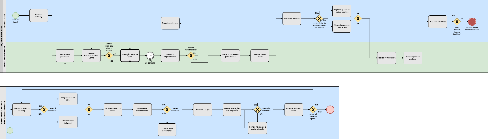

# 1.3.1. Modelagem BPMN — Processo de Desenvolvimento

## Abordagem Metodológica: Scrum e XP

Para suprir as demandas de gestão e de engenharia de software, a equipe optou por uma abordagem híbrida, combinando o *framework* Scrum e as práticas do *Extreme Programming* (XP).

### Gestão do Ciclo de Vida (Scrum)

O Scrum foi adotado como alicerce para a gestão do trabalho em ciclos curtos (Sprints), garantindo previsibilidade, transparência e inspeção contínua. O fluxo foi estruturado com base em seus artefatos e cerimônias essenciais:

- **Planejamento da Sprint:** Definição tática dos objetivos da iteração e seleção dos itens do *Product Backlog*.
- **Daily Assíncrona (3x na semana):** Adaptação do framework Scrum onde a sincronização da equipe ocorre de forma assíncrona para acompanhamento de progresso e mitigação rápida de impedimentos, respeitando a disponibilidade dos membros.
- **Sprint Review & Retrospectiva:** Cerimônias de validação do incremento gerado e análise crítica do processo visando a melhoria contínua.

### Práticas de Engenharia (XP)

Enquanto o Scrum organiza a cadência macro, as práticas de XP foram integradas para assegurar a excelência técnica durante a construção do software:

- **Programação em Pares:** Aplicada estrategicamente em tarefas de alta complexidade para reduzir defeitos e nivelar o conhecimento da equipe.
- **Test-Driven Development (TDD) e Refatoração:** A regra de escrever e executar testes antes da implementação da funcionalidade, seguida da refatoração obrigatória, visando um código limpo e sustentável.
- **Integração Contínua:** Submissão frequente de código para evitar gargalos de *merge* no fim do ciclo.

### Justificativa da Escolha

A combinação Scrum + XP foi selecionada por equilibrar duas frentes críticas no desenvolvimento de software: a necessidade de uma gestão de escopo rigorosa (Scrum) e a demanda por alta qualidade no código-fonte entregue (XP). O Scrum fornece as fronteiras do *Timebox* e o foco no valor de negócio, enquanto o XP atua "dentro da caixa" da Sprint, fornecendo as ferramentas técnicas para que a equipe entregue com qualidade ao longo das iterações.

## Diagramas BPMN

A modelagem do processo de trabalho foi dividida em duas visões para facilitar a compreensão dos fluxos macro e micro.

*Figura 13 — Fluxo Macro de Gestão (Scrum): mapeia a interação em raias entre o Product Owner e o Time de Desenvolvimento, com o loop da Sprint, resoluções de impedimentos e etapas de validação.*

*Figura 14 — Fluxo Micro de Desenvolvimento Diário (XP): detalha o subprocesso de execução técnica, com a árvore de decisão para tarefas complexas (Pair Programming) versus simples, e os loops obrigatórios de qualidade técnica.*

## Definição de Compromissos Semanais (Sprint)

Para garantir previsibilidade, transparência e melhoria contínua ao longo das Sprints, a equipe definiu um conjunto estruturado de compromissos semanais alinhados às práticas do Scrum e adaptados à realidade do grupo.

### Daily Assíncrona

As *Dailies* serão realizadas de forma assíncrona **três vezes por semana** (terça-feira, quinta-feira e sábado). Cada membro da equipe deverá registrar sua atualização contendo: progresso desde a última atualização, planejamento das próximas atividades e identificação de impedimentos. Todas as Dailies serão documentadas no GitPages, na seção de Iniciativas Extras.

### Reunião Semanal de Sprint

A equipe realizará uma reunião síncrona semanal aos **domingos**, estruturada em duas partes:

**Sprint Review e Retrospectiva** — apresentação das funcionalidades desenvolvidas, validação do incremento e análise do processo da equipe com identificação de pontos positivos, negativos e oportunidades de melhoria.

**Sprint Planning** — definição dos objetivos da Sprint, seleção e priorização das Issues do backlog de acordo com a priorização MoSCoW, e distribuição inicial das tarefas entre os membros. Todas as decisões serão registradas em atas no GitPages.

### Compromissos da Equipe

A equipe se compromete a manter a frequência e regularidade das cerimônias estabelecidas, garantir a atualização contínua da documentação, registrar impedimentos de forma clara e antecipada, seguir as práticas definidas de Scrum e XP durante toda a Sprint e assegurar a transparência das informações por meio dos registros no GitPages.

## Análise Crítica

O exercício de transpor o trabalho ágil para a notação BPMN estrita revelou gargalos que antes eram invisíveis. Durante as versões iniciais do diagrama, faltavam "loops de retorno" adequados nas etapas de teste e integração, e a ausência da gestão de impedimentos poderia gerar um gargalo no fluxo. A correção desses *gateways* lógicos forçou a equipe a adotar um critério de "Pronto" (*Definition of Done*) mais rigoroso, garantindo que a qualidade técnica exigida pelo XP não seja negligenciada sob a pressão do tempo do Scrum.

A decisão de realizar as Dailies de forma assíncrona e limitá-las a 3 vezes por semana mostrou-se uma adaptação adequada para a realidade da equipe, mantendo o alinhamento sem sobrecarregar as agendas.

Os diagramas detalhados do processo de desenvolvimento fornecem a base metodológica para a equipe. A [Modelagem do Software](Base/1.3.2.ModelagemSoftware.md) complementa esta visão ao representar os fluxos de interação do usuário com o sistema.
