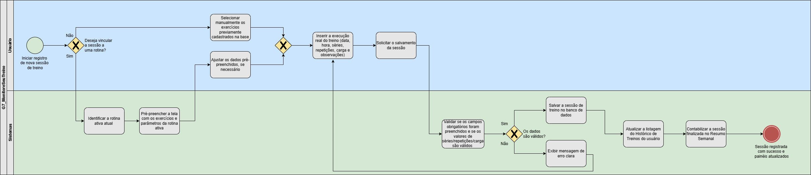

# 1.3.2. Modelagem do Software

A modelagem do software visa representar os fluxos de interação do usuário com o sistema, detalhando as etapas e regras de negócio de cada funcionalidade por meio da notação BPMN.

## Fluxo de Registrar Sessão de Treino

Este fluxo detalha os passos necessários para que um usuário registre uma sessão de treino no aplicativo, desde a seleção do treino até a confirmação do salvamento.

[Download do Fluxo (PNG)](anexos/img/registro_sessao.png ':ignore')

*Figura 15 — BPMN do fluxo de registrar sessão de treino.*

O fluxo está diretamente vinculado aos requisitos funcionais do módulo de Sessão de Treino (RF10–RF13) e às regras de negócio de validação e consistência de dados, garantindo rastreabilidade entre a modelagem e a especificação do sistema.
