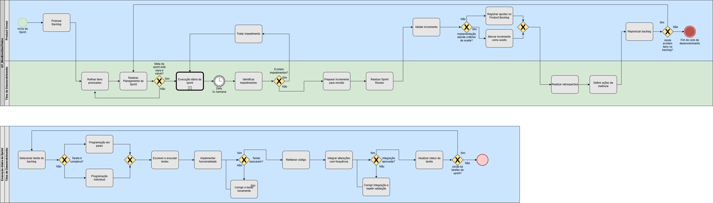

# 1.3. Módulo Modelagem BPMN

## 1. Introdução

Este módulo apresenta a modelagem BPMN (*Business Process Model and Notation*) do projeto **G7_MonitoreSeuTreino**, com foco na padronização e otimização do processo de trabalho da equipe. A proposta da modelagem é representar, de forma visual e estruturada, como as atividades são planejadas, executadas, validadas e revisadas ao longo das iterações de desenvolvimento do software.

A BPMN é uma notação gráfica consolidada internacionalmente para descrever processos de forma rigorosa, reduzindo a ambiguidade entre as perspectivas técnica e de negócio. Em vez de operar apenas com descrições textuais, a modelagem permite visualizar o fluxo de valor ponta a ponta, destacando responsabilidades sistêmicas (através de *Pools* e *Lanes*), a cronologia das ações e as condições lógicas (*Gateways*) que determinam o roteamento do trabalho. Essa formalização facilita a comunicação interna e garante a rastreabilidade entre os requisitos e o incremento do produto.

## 2. Abordagem Metodológica: Scrum e XP

Para suprir as demandas de gestão e de engenharia de software, a equipe optou por uma abordagem híbrida, combinando o *framework* Scrum e as práticas do *Extreme Programming* (XP). 

### 2.1. Gestão do Ciclo de Vida (Scrum)
O Scrum foi adotado como alicerce para a gestão do trabalho em ciclos curtos (Sprints), garantindo previsibilidade, transparência e inspeção contínua. O fluxo foi estruturado com base em seus artefatos e cerimônias essenciais:
*   **Planejamento da Sprint:** Definição tática dos objetivos da iteração e seleção dos itens do *Product Backlog*.
*   **Daily (3x na semana):** Sincronização da equipe para acompanhamento de progresso e mitigação rápida de impedimentos.
*   **Sprint Review & Retrospectiva:** Cerimônias de validação do incremento gerado e análise crítica do processo visando a melhoria contínua.

### 2.2. Práticas de Engenharia (XP)
Enquanto o Scrum organiza a cadência macro, as práticas de XP foram integradas para assegurar a excelência técnica durante a construção do software. As principais práticas representadas no fluxo de desenvolvimento incluem:
*   **Programação em Pares:** Aplicada estrategicamente em tarefas de alta complexidade para reduzir defeitos e nivelar o conhecimento da equipe.
*   **Test-Driven Development (TDD) e Refatoração:** A regra de escrever e executar testes antes da implementação da funcionalidade, seguida da refatoração obrigatória, visando um código limpo e sustentável.
*   **Integração Contínua:** Submissão frequente de código para evitar gargalos de *merge* no fim do ciclo.

### 2.3. Justificativa da Escolha
A combinação Scrum + XP foi selecionada por equilibrar duas frentes críticas no desenvolvimento de software: a necessidade de uma gestão de escopo rigorosa (Scrum) e a demanda por alta qualidade no código-fonte entregue (XP). O Scrum fornece as fronteiras do *Timebox* e o foco no valor de negócio, enquanto o XP atua "dentro da caixa" da Sprint, fornecendo as ferramentas técnicas para que a equipe entregue com qualidade ao longo das iterações.

## 3. Modelagem BPMN

A modelagem do processo de trabalho foi dividida em duas visões para facilitar a compreensão dos fluxos macro e micro.

*   **Figura 1: Fluxo Macro de Gestão (Scrum)**
    *   **Descrição:** Este diagrama mapeia a interação em raias entre o *Product Owner* (PO) e o Time de Desenvolvimento. Destaca-se o loop da execução da Sprint, limitado pelo *Timebox*, as resoluções de impedimentos e as etapas de validação formal antes do encerramento do ciclo.
*   **Figura 2: Fluxo Micro de Desenvolvimento Diário (XP)**
    *   **Descrição:** Este diagrama detalha o subprocesso de execução técnica. Ilustra a árvore de decisão para tarefas complexas (*Pair Programming*) versus simples, e os loops obrigatórios de qualidade técnica, onde integrações e testes falhos retornam compulsoriamente para correção antes de avançarem no fluxo.

## 4. Análise Crítica

### 4.1. Modelagem
O exercício de transpor o trabalho ágil para a notação BPMN estrita revelou gargalos que antes eram invisíveis. Durante as versões iniciais do diagrama, percebemos que faltavam "loops de retorno" adequados nas etapas de teste e integração (o que permitiria que código defeituoso avançasse) e que ausência da gestão de impedimentos poderia gerar um gargalo no fluxo. A correção desses *gateways* lógicos no BPMN forçou a equipe a adotar, na vida real, um critério de "Pronto" (*Definition of Done*) muito mais rigoroso, garantindo que a qualidade técnica exigida pelo XP não seja negligenciada sob a pressão do tempo do Scrum. A integração das metodologias trouxe maturidade ao time. A decisão de limitar as Dailies para 3 vezes por semana (em vez de diárias) mostrou-se uma adaptação eficiente para a realidade de todos da equipe, mantendo o alinhamento sem sobrecarregar as agendas.

## 5. Rastreabilidade e Participação da Equipe

Para garantir que a execução metodológica tenha lastro na realidade do projeto, estabelecemos as seguintes ligações:
*   As tarefas representadas no nó "Selecionar tarefa do backlog" (BPMN) estão diretamente vinculadas às *Issues* rastreáveis no GitHub do projeto.
*   A "Integração Contínua" modelada reflete-se na política de *Pull Requests* e validação por pares exigida nos repositórios.

### 5.1. Quadro de Participações

| Membro | Papel / Contribuição neste Módulo | Commits / Artefatos |
| :--- | :--- | :--- |
| **Daniel Teles** | Modelagem BPMN (Fluxo Macro e Micro), Revisão lógica dos Gateways e loops de XP, Edição do Documento | `[Link p/ Commits]` / `.md`, `.bpmn` |
| **Lucas Antunes** | Criação inicial do documento, levantamento de práticas Scrum e estruturação da Wiki | `[Link p/ Commits]` / `.md` |
| *[Nome]* | *[Atividade]* | *[Link]* |
| *[Nome]* | *[Atividade]* | *[Link]* |

## 6. Referências Bibliográficas

1.  **OMG (Object Management Group).** *Business Process Model and Notation (BPMN) Version 2.0.2*. 2013. Disponível em: [https://www.omg.org/spec/BPMN/2.0.2/](https://www.omg.org/spec/BPMN/2.0.2/)
2.  **SCHWABER, K.; SUTHERLAND, J.** *The Scrum Guide: The Definitive Guide to Scrum: The Rules of the Game*. 2020. Disponível em: [https://scrumguides.org/](https://scrumguides.org/)
3.  **WELLS, Don.** *Extreme Programming: A gentle introduction*. 2009. Disponível em: [http://www.extremeprogramming.org/](http://www.extremeprogramming.org/)

## 7. Histórico de Versões

| Versão | Data | Descrição | Autor(es) | Revisor(es) |
| :--- | :--- | :--- | :--- | :--- |
| 1.1 | 03/04/2026 | Adiciona informações e diagramas | Daniel Teles | - |
| 1.0 | 31/03/2026 | Criação do documento | Lucas Antunes | — |