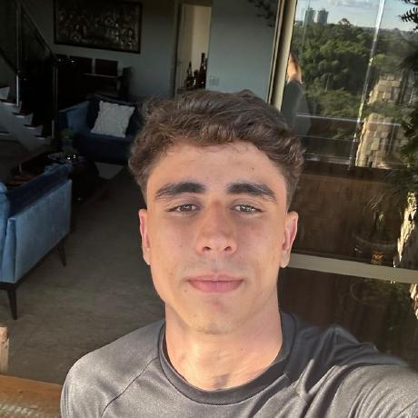
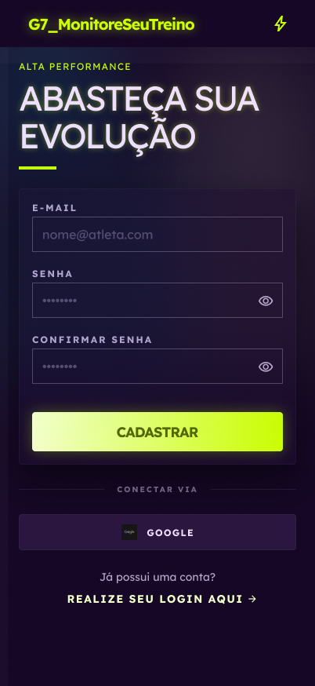
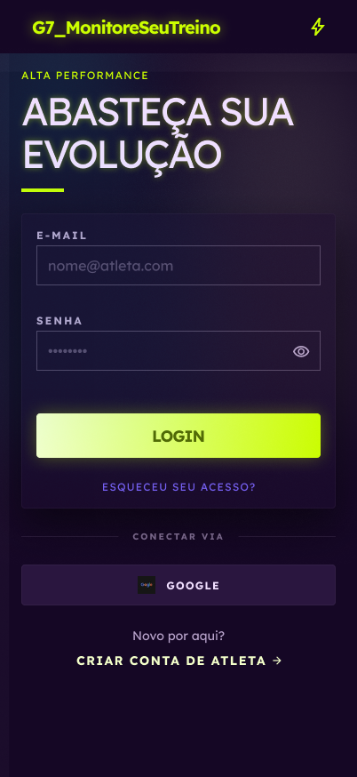
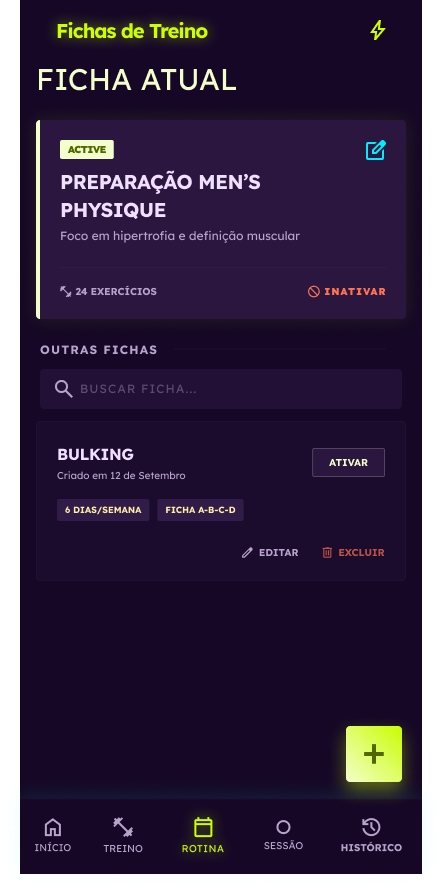

# Grupo 7 — MonitoreSeuTreino

**Código da Disciplina**: FGA0208<br>
**Número do Grupo**: 07<br>
**Entrega**: 01 — Primeira Entrega<br>
**Período**: 30/03/2026 a 06/04/2026<br>

<div class="tech-grid" style="grid-template-columns: repeat(3, 1fr); margin-top: 1rem;">
  <a href="https://github.com/UnBArqDsw2026-1-Turma01/2026.1-T01-_G7_MonteSeuTreino_Entrega_01" target="_blank" class="tech-item" style="text-decoration: none; justify-content: center; cursor: pointer;">
    <strong>Repositório GitHub</strong>
  </a>
  <a href="anexos/Apresentação_G7_MonitoreSeuTreino_In_Progress.pdf" download class="tech-item" style="text-decoration: none; justify-content: center; cursor: pointer;">
    <strong>Apresentação (PDF)</strong>
  </a>
  <a href="#/Base/1.Base" class="tech-item" style="text-decoration: none; justify-content: center; cursor: pointer;">
    <strong>Contribuições e Relatos</strong>
  </a>
</div>

<div class="tech-grid" style="grid-template-columns: repeat(4, 1fr); margin-top: 0.5rem;">
  <a href="https://github.com/orgs/UnBArqDsw2026-1-Turma01/projects/4/views/2" target="_blank" class="tech-item" style="text-decoration: none; justify-content: center; cursor: pointer; font-size: 0.85rem; padding: 8px 10px; background: #f0f4f8;">
    Quadro Kanban
  </a>
  <a href="#/Base/1.1.3.BacklogProduto" class="tech-item" style="text-decoration: none; justify-content: center; cursor: pointer; font-size: 0.85rem; padding: 8px 10px; background: #f0f4f8;">
    Backlog do Produto
  </a>
  <a href="#/Base/1.5.6.Milestones" class="tech-item" style="text-decoration: none; justify-content: center; cursor: pointer; font-size: 0.85rem; padding: 8px 10px; background: #f0f4f8;">
    Milestones
  </a>
  <a href="#/Base/1.5.7.AtasReuniao" class="tech-item" style="text-decoration: none; justify-content: center; cursor: pointer; font-size: 0.85rem; padding: 8px 10px; background: #f0f4f8;">
    Atas de Reunião
  </a>
</div>

## Alunos

<div class="members-grid">

<div class="member-card">
  <div class="member-header">
    
    <div class="member-info">
      <h4>André Ricardo Meyer De Melo</h4>
      <p>Matrícula: 231011097</p>
      <p>GitHub: <a href="https://github.com/AndreMeyerr" target="_blank">AndreMeyerr</a></p>
    </div>
  </div>
</div>

<div class="member-card">
  <div class="member-header">
    
    <div class="member-info">
      <h4>Daniel Teles Brito</h4>
      <p>Matrícula: 231012174</p>
      <p>GitHub: <a href="https://github.com/dtdanielteles" target="_blank">dtdanielteles</a></p>
    </div>
  </div>
</div>

<div class="member-card">
  <div class="member-header">
    
    <div class="member-info">
      <h4>Eduardo Oliveira Valadares</h4>
      <p>Matrícula: 231026311</p>
      <p>GitHub: <a href="https://github.com/EduOValadares" target="_blank">EduOValadares</a></p>
    </div>
  </div>
</div>

<div class="member-card">
  <div class="member-header">
    
    <div class="member-info">
      <h4>Eduardo Silva Waski</h4>
      <p>Matrícula: 231011284</p>
      <p>GitHub: <a href="https://github.com/EduardoWaski" target="_blank">EduardoWaski</a></p>
    </div>
  </div>
</div>

<div class="member-card">
  <div class="member-header">
    
    <div class="member-info">
      <h4>Giovanni Dornelas Ferreira</h4>
      <p>Matrícula: 232002664</p>
      <p>GitHub: <a href="https://github.com/GGdornelas" target="_blank">GGdornelas</a></p>
    </div>
  </div>
</div>

<div class="member-card">
  <div class="member-header">
    
    <div class="member-info">
      <h4>João Maurício Pilla Nascimento</h4>
      <p>Matrícula: 231011533</p>
      <p>GitHub: <a href="https://github.com/JMPNascimento" target="_blank">JMPNascimento</a></p>
    </div>
  </div>
</div>

<div class="member-card">
  <div class="member-header">
    
    <div class="member-info">
      <h4>José Victor Gabriel Menezes da Costa</h4>
      <p>Matrícula: 231027121</p>
      <p>GitHub: <a href="https://github.com/RR2M4A" target="_blank">RR2M4A</a></p>
    </div>
  </div>
</div>

<div class="member-card">
  <div class="member-header">
    
    <div class="member-info">
      <h4>Lucas Gabriel da Silva Antunes</h4>
      <p>Matrícula: 190091681</p>
      <p>GitHub: <a href="https://github.com/LucasGSAntunes" target="_blank">LucasGSAntunes</a></p>
    </div>
  </div>
</div>

<div class="member-card">
  <div class="member-header">
    
    <div class="member-info">
      <h4>Mateus Santos Negrini</h4>
      <p>Matrícula: 200024825</p>
      <p>GitHub: <a href="https://github.com/14luke08" target="_blank">14luke08</a></p>
    </div>
  </div>
</div>

<div class="member-card">
  <div class="member-header">
    
    <div class="member-info">
      <h4>Samuel Nogueira Caetano</h4>
      <p>Matrícula: 231027186</p>
      <p>GitHub: <a href="https://github.com/samuelncaetano" target="_blank">samuelncaetano</a></p>
    </div>
  </div>
</div>

</div>

## Sobre

O **MonitoreSeuTreino** é um sistema web voltado para praticantes de exercícios físicos que desejam organizar, registrar e acompanhar seus treinos semanais. A plataforma oferece uma experiência simples e focada, centrada na classificação do perfil do usuário por meio de um onboarding inicial, na montagem de treinos adequados ao seu nível e gênero, no registro da execução e na visualização da constância, sem a complexidade de soluções existentes no mercado.

### Objetivo Geral

Promover a organização e a constância no treino semanal do usuário, reduzindo a perda de informações sobre as sessões realizadas, facilitando o acompanhamento da regularidade e apoiando a evolução contínua nos exercícios físicos.

### Características da Solução

1. **Ficha de Treino Semanal** — Criação e edição de fichas de treino semanais, permitindo ao usuário montar sua rotina definindo divisões como Treino A, B e C ou por dias da semana, incluindo exercícios e parâmetros planejados como séries e repetições alvo.

2. **Registro de Execução do Treino** — Registro do que foi efetivamente realizado em uma sessão de treino, incluindo data, hora, referência à rotina quando aplicável, séries, repetições, carga e observações.

3. **Histórico de Treinos** — Listagem de sessões concluídas organizadas por data, com possibilidade de consultar os detalhes completos de cada sessão, permitindo recuperação rápida de informações passadas.

4. **Resumo Semanal** — Painel consolidado que apresenta a quantidade de treinos realizados na semana e os dias com atividade registrada, oferecendo uma visão clara e imediata da regularidade do usuário no período.

5. **Onboarding e Montagem de Treino por Perfil** — Fluxo inicial de perguntas que classifica o usuário por gênero e nível de experiência — iniciante, intermediário ou avançado. Com base nessa classificação, o sistema monta automaticamente uma sugestão de treino semanal adequada ao perfil identificado, que o usuário pode adotar, ajustar ou substituir livremente.

### Tecnologias

<div class="tech-grid">
  <div class="tech-item"><strong>Frontend</strong> React com TypeScript</div>
  <div class="tech-item"><strong>Backend</strong> Node.js com TypeScript</div>
  <div class="tech-item"><strong>Banco de Dados</strong> PostgreSQL</div>
  <div class="tech-item"><strong>Infraestrutura</strong> Deploy gratuito ou baixo custo</div>
</div>

## Protótipo

O protótipo de alta fidelidade foi desenvolvido no Figma com foco mobile first, cobrindo o fluxo principal do MVP — do cadastro ao monitoramento semanal. A validação com o público-alvo foi conduzida pela plataforma Maze.

[Figma](https://www.figma.com/design/0d6wLlJy9Ch4P1h1M3CTED/Projeto-Academia?node-id=11-2&t=yMaY1xDnk7CgI0D7-1 ':target=_blank') | [Maze](https://app.maze.co/maze-preview/mazes/519454254 ':target=_blank')

Versão mobile — fluxo principal do usuário, do cadastro ao acompanhamento dos treinos:

<div class="proto-gallery" style="grid-template-columns: repeat(6, 1fr);">
  <div class="proto-item">
    
    <div class="proto-caption">Cadastro</div>
  </div>
  <div class="proto-item">
    
    <div class="proto-caption">Login</div>
  </div>
  <div class="proto-item">
    
    <div class="proto-caption">Dashboard</div>
  </div>
  <div class="proto-item">
    
    <div class="proto-caption">Registrar Sessão</div>
  </div>
  <div class="proto-item">
    
    <div class="proto-caption">Ficha de Treino</div>
  </div>
  <div class="proto-item">
    
    <div class="proto-caption">Histórico</div>
  </div>
</div>

Versão web — adaptação responsiva das principais telas para desktop:

<div class="proto-gallery" style="grid-template-columns: repeat(2, 1fr);">
  <div class="proto-item">
    
    <div class="proto-caption">Login</div>
  </div>
  <div class="proto-item">
    
    <div class="proto-caption">Resumo Semanal</div>
  </div>
  <div class="proto-item">
    
    <div class="proto-caption">Registro de Treino</div>
  </div>
  <div class="proto-item">
    
    <div class="proto-caption">Minha Rotina (vazio)</div>
  </div>
  <div class="proto-item">
    
    <div class="proto-caption">Minha Rotina (com itens)</div>
  </div>
  <div class="proto-item">
    
    <div class="proto-caption">Histórico de Treinos</div>
  </div>
</div>

> Para explorar todas as telas e interações, acesse o protótipo completo no Figma ou realize o teste de usabilidade pelo Maze.

## Como Executar a Documentação Localmente

A documentação é gerada com [Docsify](https://docsify.js.org/). Para visualizá-la localmente:

```bash
# Instalar o Docsify CLI (caso ainda não tenha)
npm i docsify-cli -g

# Na raiz do repositório, iniciar o servidor local
docsify serve ./docs
```

A documentação estará disponível em `http://localhost:3000`.

## Informações Complementares

- A documentação completa de cada artefato está disponível na **barra lateral**, organizada por módulo da entrega.
- O acompanhamento das atividades da equipe é feito via [GitHub Projects (Kanban)](https://github.com/orgs/UnBArqDsw2026-1-Turma01/projects/4/views/2).
- Dúvidas ou sugestões podem ser registradas como [issues](https://github.com/UnBArqDsw2026-1-Turma01/2026.1-T01-_G7_MonteSeuTreino_Entrega_01/issues) no repositório.
